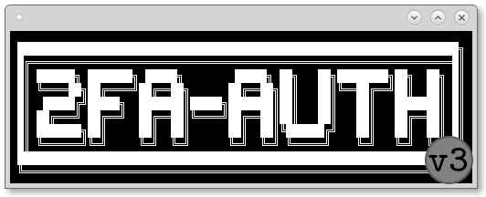

# 2FA-Auth

---

 

***2FA-Auth*** is a BASH script that provides a user-friendly way to generate *"Two-Factor Authentication (2FA)"* code. It works like Google Authenticator® and similar programs, but you can use your GNU/Linux terminal, instead of your cellphone.

For more information, look for *"Two-Factor Authentication"* in sites or forums.

 

**System Requirement**

* GNU/Linux distribution with BASH interpreter

* GIT -- used to clone 2FA-Auth into your computer

* GnuPG -- used to keep your site/service token encrypted

* OATH Toolkit a.k.a. OATHTOOL -- used to generate 2FA codes

2FA-Auth can automatically install GnuPG and OAth Toolkit, but if it fails, please check how to install the programs above, according to your distribution.

This automatic method of package installation involves these package managers:

* APT and APT-GET for Debian-based systems
* DNF, URPMI and YUM for RedHat-based systems
* EMERGE and EQUO for Gentoo-based systems
* PACMAN for Arch-based systems
* ZYPPER for SUSE/openSUSE-based systems

The next step is that you **MUST** create or import *GPG Keys* in your profile. They are used by GnuPG to encrypt and decrypt your tokens.

 

**PDF FILE: "2FA-Auth/doc/How_to_use_2FA-Auth.pdf"**

This file explain how to use 2FA-Auth.

It's a simple "how to use" manual, but it helps you A LOT!

 

**Where does 2FA-Auth save my tokens and GnuPG ID?**

GPG key is created (or imported) into ***$HOME/.gnupg/*** while GPG ID is part of your key (UserID) and 2FA-Auth asks for it. Your UserID is the e-mail used to create your key.

***2FA-Auth*** saves your 2FA token(s) in this directory: ***$HOME/.config/2fa-auth/*** and your GnuPG UserID is saved in ***$HOME/.config/2fa-auth/2fa-auth.info***

 
Copyleft - Vinicius de Alencar (alencc1986) – 2021
